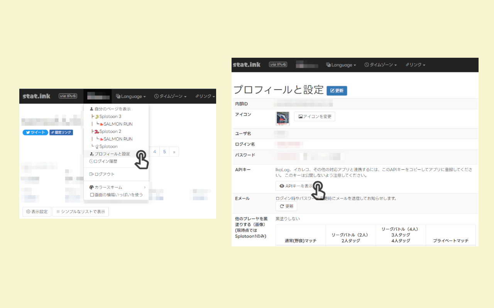
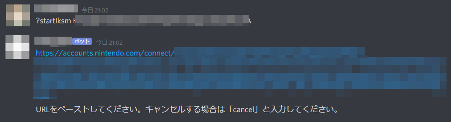
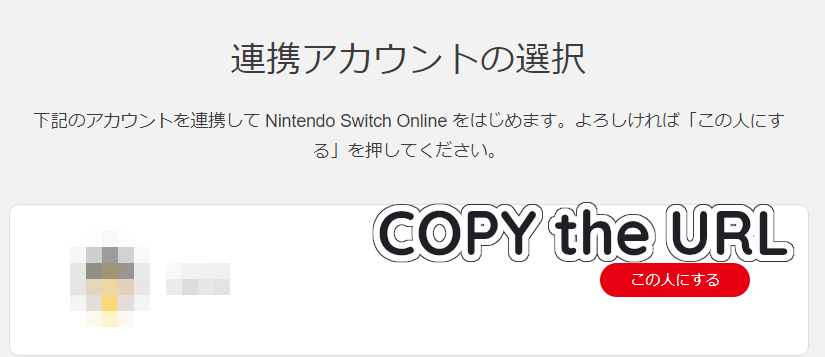
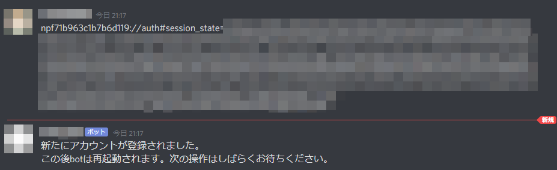

# yt_SplatoonDiscordBot

Discord Bot on Python for Splatoon with s3s and stat.ink

[DiscordBot_Heroku_Stat.ink](https://github.com/TomoTom0/DiscordBot_Heroku_Stat.ink)'s successor Repository.

## Introduction

I organized the script of Discord Bot I use myself.

Detailed usage and exams will be performed later.

The published [DiscoBot_heroku_stat.ink](https://github.com/tomotom0/discordBot_heroku_stat.ink) is the transition to specifications, the transition to Splatoon 2-> 3, and to the transition of S3S for practical use. In response to the unbearable, I created this Repository.

Upload the results to Stat.ink using S3s. (Save to Local as option, Upload from local can be done.)

**`bullet_token` and `gtoken`, which are necessary for checking battle records, can also be obtained through Discord Bot.**

## Environments

It is assumed to be used in NAS and GCP.

It seems that Heroku's free frame has disappeared.

### Environmental Variables

|Environmental Variables|Default Value|Description|
|-|-|-|
|`SPLATOON_DISCORD_BOT_TOKEN`|Mandatory|TOKEN in`main` mode of Discord Bot. You need to get it.|
|`SPLATOON_DISCORD_BOT_INTERVAL`|7200  Battle upload interval (unit is seconds). The default is 2 hours. **If it is less than 900 seconds, it will be changed to 7200 seconds.**|
|`SPLATOON_DISCORD_BOT_UPLOAD`|True|To upload it to Stat.ink by checking the period (true), only save the JSON file in LOCAL (False). The default is the former. The value is interpreted in the Boolean type.|
|`SPLATOON_DISCORD_BOT_TOKEN_TEST`|Omable| TOKEN in the`test` mode of Discord Bot. If omitted, `Splatoon_discord_bot_token` is used.|
|`SPLATOON_DISCORD_BOT_IGNORED_CHANNELS_MAIN`||`main`A comma (`,`) separated list of channel IDs that the BOT does not respond to in the mode|
|`SPLATOON_DISCORD_BOT_IGNORED_CHANNELS_TEST`||`test`A comma (`,`) separated list of channel IDs that the BOT does not respond to in the mode|
|`SPLATOON_DISCORD_BOT_NOTICED_CHANNELS_MAIN`||`main`A comma (`,`) separated list of channel IDs that the BOT responds to in the mode|
|`SPLATOON_DISCORD_BOT_NOTICED_CHANNELS_TEST`||`test`A comma (`,`) separated list of channel IDs that the BOT responds to in the mode|

If each mode Noticed_Channels is not empty, Ignored_channels is ignored.

## Bot until operation

Quoted from [DiscordBot_Heroku_Stat.ink](https://github.com/TomoTom0/DiscordBot_Heroku_Stat.ink). However, Heroku is not supported.

### Advance preparation (required)

- **stat.ink**: Create account, API Key copy

- **discord**: Account creation, developer registration, Application creation, Discord Bot Token Copy, BOT Server, Bot settings and edit
  - Reference [Discord bot account initial setting guide for developer](https://qiita.com/1ntegrale9/items/cb285053f2fa5d0CCCDF) **Register to the server**

- **Nintendo**: The results check requires a Nintendo account that plays Splatoon3. Also, if you log in to the Nintendo account with the default browser in advance, it will proceed smoothly **. If you forget your password, reset your password without any trouble.

### bot until startup

Download with `git clone`, etc., and install the required library with`pip3 install -r requirements.txt`. Finally, start Discord Bot with `python3 src/main.py`. It is okay if there is no error message in Terminal. Please use `screen` and`nohup` as needed.

If you place `test` as the first argument as the`python3 src/main.py test`, it will be in `test` mode. In `test` mode, the results are not performed automatically. Please use it when checking the environment.

### Intents setting

In order to handle Message etc. in Discord Bot (selected in the invitation link generation), you also need to set Intents.

[Discord.py Reference page](https://discordpy.readthedocs.io/en/stable/intents.html#privileged-intents) Please enable "MESSAGE CONTENT INTENT" of "Privileged Gateway Intents".

## How To Use

You can execute various commands with `?command` with`?`As prefix. Some commands can enter arguments in space.

You can also check the Help and command list of the bot itself with `?help`. You can also check the details of `command` with`?help command`.

### Nintendo account registration to bot

`?startIksm <STATINK_API_KEY>`

1. Submit your account with [stat.ink](https://stat.ink/) and copy API Key. 

2. In the DM with the bot, such as `?startiksm <statink_api_key>`, enter and send API Key following `?startiksm`. (If you subscribe to the same server as **bot, you can perform that bot and DM, depending on the setting of the account.**)
> ※Caution

**API Key or Token, etc. are equivalent to the account name and password set. It's very dangerous to be exposed to others**

It may be okay for a server with only a family or a close friend, but please go to `? Startiksm` with a DM with BOT as much as possible. **

3. Then, the URL will be sent from the bot, so tap the link. 

4. If you log in at the link destination, it will be the selection screen of the linked account. Right -click **“Put this person” (press and hold on a smartphone) and copy the linked URL.**

If it takes too long, it will be a timeout and will start over from `? Startiksm`.

5. Return to Discord, paste the copied link, and wait a little time, the new account was registered. `Is displayed.

If you can do so far, regular uploads will be performed automatically. (Default is 2 hours. Environmental variables are set with `SPLATOON_DISCORD_BOT_INTERVAL`.)

### Various commands

You can also confirm by entering `?help splat` and bot.

| Command | Arguments | Description |
|-|-|-|
|`?startIksm`|`STAT_INK_API_KEY`?| Complete Stat.ink registration in advance and get API Key. If the argument is omitted, Interactive is required to enter. |
|`?checkIksm`|`acc_name`?|If the argument is omitted, Interactive is required to enter. |
||`?rmIksm`|`acc_name`?| Delete information on the specified account. If the argument is omitted, Interactive is required to enter. |
|`?showIksm`| None | Display the registered Nintendo account list. |
|`?upIksm`|`acc_name`?| The operation takes a while. If `ACC_NAME` is entered, only the specified account is checked. |
|`?upIksmFromLocal`|`acc_name`?| The operation takes a while. If `ACC_NAME` is entered, only the specified account is checked. |

### Accessibility

**Since v1.2.1, certain restrictions have been added to the newly registered Nintendo account information.**

This is assumed that one bot can be added to multiple servers.

The default behavior is as shown in the table below.

|`?startIksm` Execution location | Place where access is allowed |
|-|-|
| Server | DM with registered server and registered users |
| DM | DM with registered users |

In a place without access authority, the account is treated as not registered in the command with Discord Bot.

**V1.2.0 Nintendo accounts are unlimited for the Nintendo account.**

Access restriction information is managed within `configs_s3s/access_permission.json`.

If `[-1]` is given as a list of `id`, that item is unlimited.

|key|value|
|-|-|
|guild|List of server (guild) id|
|dm|list of discord user ids|
|author|A list of user ids that can edit permission_info through the discord bot (editing not yet implemented)|

## Future Works

- [] Compatible with Splatoon2 within the range of s2s (splatnet2statink)
- [] Discord bot can be used for free corresponding to Repl.it

## If you want to modify your bot to your liking

[Discord Bot Fastest Tutorial【Python&Heroku&GitHub】](https://qiita.com/1ntegrale9/items/aa4b373e8895273875a8#8-dynos%E3%81%AE%E8%A8%AD%E5%AE%9A)This is not enough.

In order to make the bot update support and use with the existing bot conveniently, you can make a unique change with `config.py` without touching `main.py`.

The main variables and functions that can be set by this bot and can be set with `config.py` are as follows. Of course, you can add other factors as needed.

Please use and add COG aggressively with reference to `ext_splat.py` etc.

|variables/function|default value/argument|description|
|-|-|-|
|`command_prefix`|`?`|Prefix when giving commands to this bot|
|`description`|Default value omitted|Description of this bot displayed when `?help`|
|`_additional_on_ready`|`bot`|function executed at the beginning of `on_ready`|
|`_additional_on_message_judge`|`bot, message`|The first function executed in `on_message` that determines whether or not to react to `message`. If the return value is `False`, do not react.|
|`_additional_on_message_remake`|`bot, message`|The second function that runs after `on_message` modifies `message` appropriately. `message` is replaced only if the return value is `discord.Message` class.|
|`_additional_on_message`|`bot, message`|3rd function executed in `on_message`|
|`_additional_on_command_error`|`bot, ctx`|function executed at the beginning of `on_command_error`|
|`_additional_on_loop`|`bot`|function executed at beginning of `loop`|

The variables and functions that are expected to be actively changed are as follows.

|variables/function|default value/argument|description|
|-|-|-|
|`DISCORD_TOKENS`|Dictionary for default value|A dictionary for when you want to use different Discord bot tokens for each `mode`|
|`mode`|`main`|`mode` The regular check of the results is performed only when `main` is included|
|`const_paths`|Professional Discount | Dictionary of various directory and file path|

## References

- frozenpandaman/s3s: https://github.com/frozenpandaman/s3s
- frozenpandaman/splatnet2statink: https://github.com/frozenpandaman/splatnet2statink
